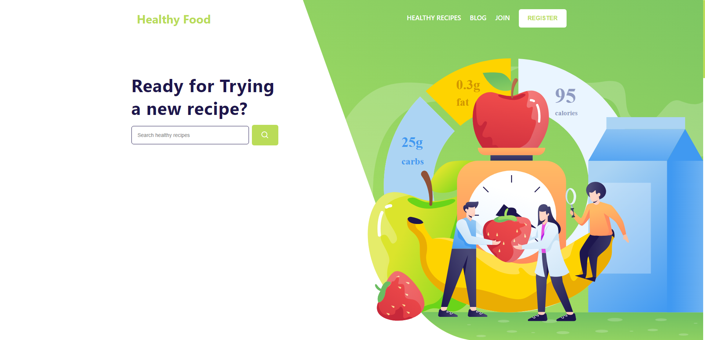
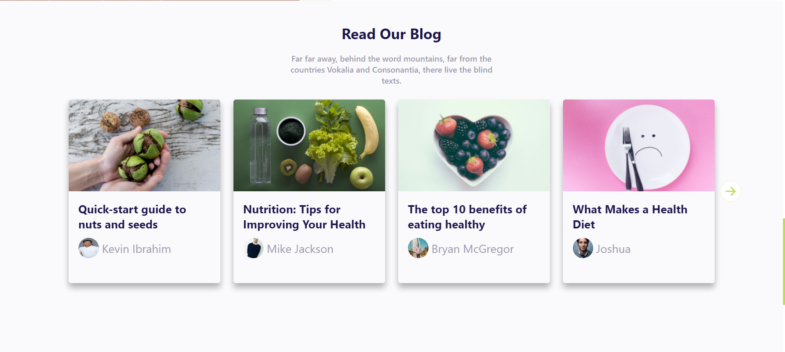
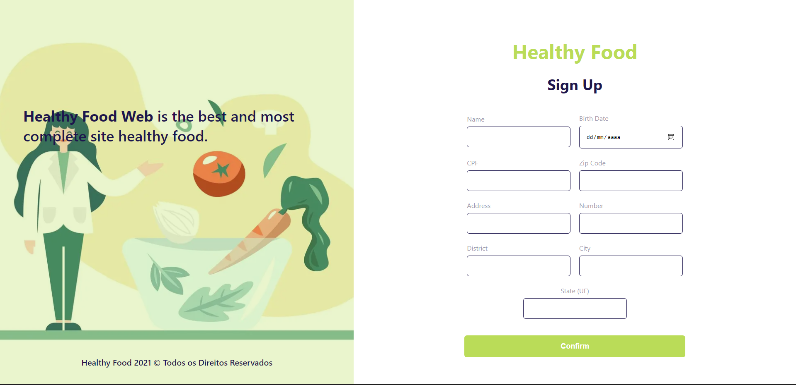
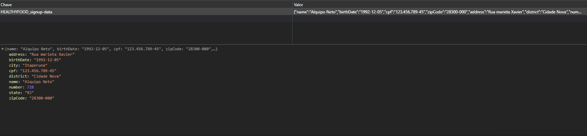
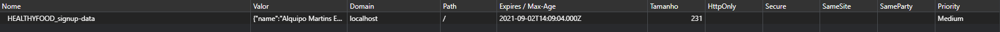
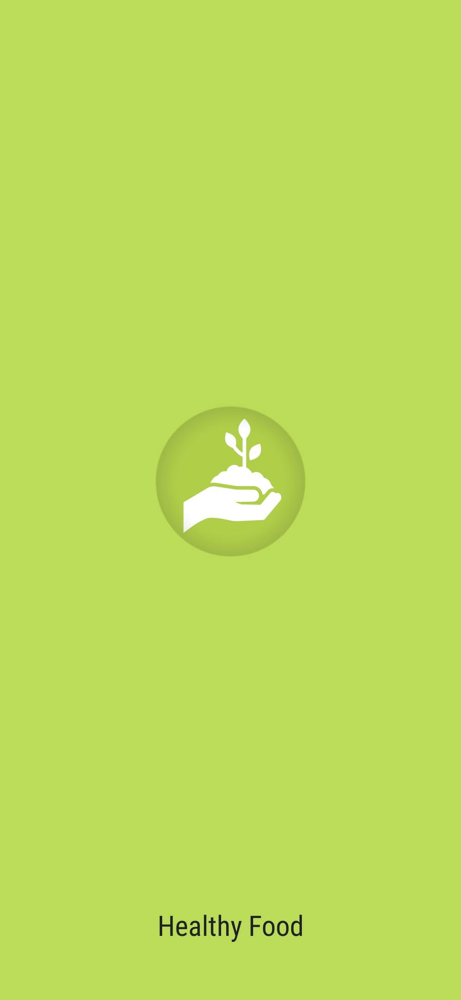
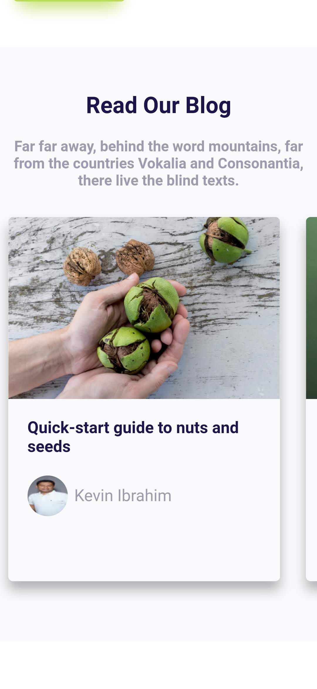
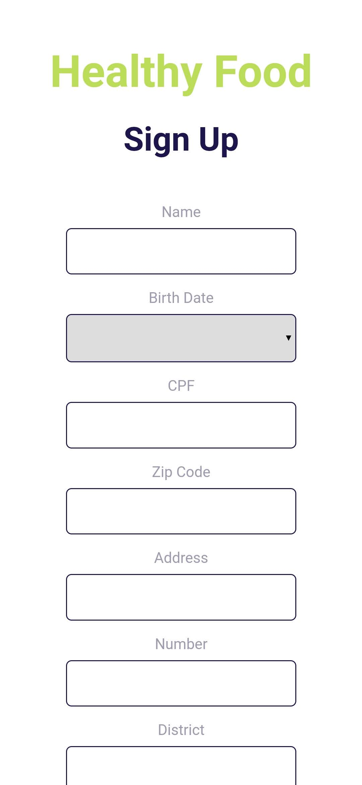
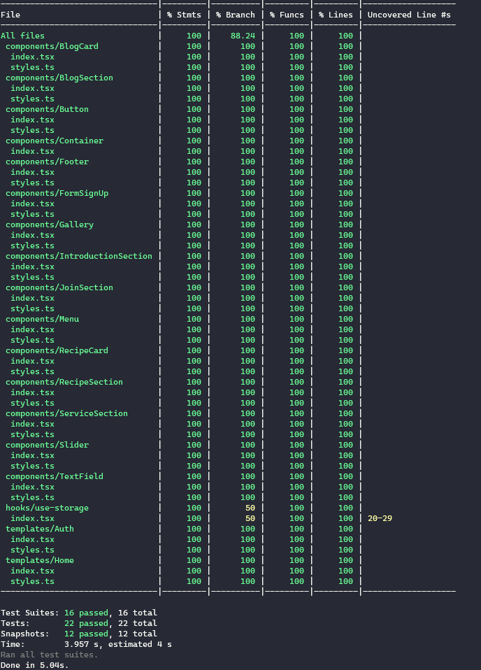
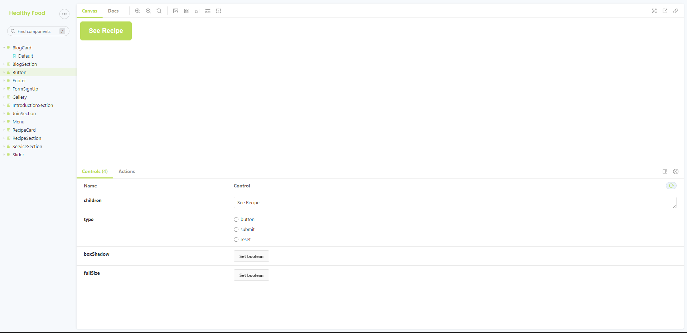

<p align="center">
  
</p>

<h1 align="center">
 Healthy Food Web
</h1>

<p align="center">

  

  

  <a href="https://www.linkedin.com/in/alquiponeto/">
      
  </a>

  <a href="https://github.com/Alquipo/health-food/commits/master">
      
  </a>

  

  

</p>

<p align="center">

  <a target="_blank" href="https://nextjs.org/">
    
  </a>

   <a target="_blank" href="https://pt-br.reactjs.org/">
    
  </a>

   <a target="_blank" href="https://storybook.js.org/">
    
  </a>


   <a target="_blank" href="https://jestjs.io/pt-BR/">
    
  </a>


</p>

## 🚀 Sobre o Desafio

Desafio consiste em criar uma landPage para um site de alimentos saudáveis. Deve ser desenvolvido usando React, conter uma pagina de SigUp com formulário e validações, Deverá efetuar um fetch na API dos correios para completar o endereço e os dados deverá ser salvo no localStorage e Cookie

## 🎉 Extras

Com a finalização dos requisitos solicitados, foram efetuadas algumas adições ao projeto, maior parte das adições foram feitas para melhorar a experiência da equipe, como: Teste Unitários com JEST, Storybook, geração de componentes personalizados com PLOP, Superset de JavaScript com TypeScript e algumas melhorias para o usuário como: Mascaras em alguns inputs e PWA com o NextJS.

Maior partes das adições foi configurado o básico, como o desafio não exigia e o tempo é curto optei por não fazer o desenvolvimento de um projeto completo, mas sim um projeto que pudesse ser usado como um desafio para o mercado.
## 🎖️ Milestone

    -Adicionar testes unitários ✔️
    -Adicionar NEXTJS Framework ✔️
    -Adicionar Storybook ✔️
    -Adicionar PWA na pagina ✔️
    -Adicionar mascara em alguns campos ✔️
    -Adicionar TypeScript ✔️
    -Adicionar Plop para geração de componentes ✔️
    -Adicionado um Slider com imagens ✔️

## 🎨 Layout

## Preview

|   Desktop   |  Mobile  |
|---------|-----------|
|  |  |


### Web

<h4 align="center">
  
  
  
</h4>
<h4 align="center">
 
  
</h4>

### Mobile (PWA)

<h4 align="center">
  
  
  
  
</h4>

### Storybook e Test

|   Test Unitário (JEST)   |  Storybook  |
|---------|-----------|
|  |  |


<br/>

## 🔨 Tecnologias:

- **[TypeScript](https://www.typescriptlang.org/)**
- **[NextJS](https://nextjs.org/)**
- **[Yup](https://www.npmjs.com/package/yup)**
- **[Styled Components](https://styled-components.com/)**
- **[Jest](https://jestjs.io/)**
- **[React Testing Library](https://testing-library.com/docs/react-testing-library/intro)**
- **[Storybook](https://storybook.js.org/)**
- **[Eslint](https://eslint.org/)**
- **[Prettier](https://prettier.io/)**
- **[PlopJS](https://plopjs.com/)**
- **[Styled-Icons](https://styled-icons.js.org/)**
- **[React Mask](https://www.npmjs.com/package/react-input-mask)**
- **[React Slick](https://react-slick.neostack.com/)**


## 🔎 Comandos

- `dev`: Executa a aplicação em `localhost:3000`
- `build`: Cria a Build do projeto
- `start`: Inicia um servidor simples com o código de produção
- `lint`: Executa o **Linter** em todos os componentes e páginas
- `test`: Executa **Jest** para testar todos os componentes e páginas
- `test:watch`: Executa **Jest** em watch mode
- `storybook`: Executa **Storybook** em `localhost:6006`
- `build-storybook`: Cria uma build do storybook
- `generate`: Cria automaticamente um componente

## 🚀 Como rodar este projeto

Para clonar e executar este aplicativo, você precisará de [Git](https://git-scm.com) e [NodeJs](https://nodejs.org/en/) Instalado em seu computador.

### 🌀 Clonando o repositório

```bash
# Clone este repositório
$ git clone https://github.com/Alquipo/health-food

# Acesse a pasta do projeto no terminal/cmd
$ cd health-food
```

### 🎲 Rodando a Aplicação

```bash

# Instale as dependências
$ yarn install

# Execute a Aplicação em Desenvolvimento
$ yarn dev

# O servidor iniciará na porta:3000 - acesse http://localhost:3000

```

### 💾 Comandos Úteis

```bash
#Criação de um componente completo com (index.tsx / stories.tsx / styles.ts / test.tsx)
$ yarn generate ComponentName

#Rodar o Storybook
$ yarn storybook

#Rodar os testes unitários
$ yarn test

```

## 🤔 Como contribuir para o projeto

- Faça um **fork** do projeto;
- Crie uma nova branch com as suas alterações: `git checkout -b my-feature`
- Salve as alterações e crie uma mensagem de commit contando o que você fez:`git commit -m "feature: My new feature"`
- Envie as suas alterações: `git push origin my-feature`

> Caso tenha alguma dúvida confira este [guia de como contribuir no GitHub](https://github.com/firstcontributions/first-contributions)

## 📝 Licença

Este projeto esta sobe a licença MIT. Veja a [LICENÇA](https://opensource.org/licenses/MIT) para saber mais.

Feito com ❤️ por Alquipo Neto 👋🏽 [Entre em contato!](https://www.linkedin.com/in/alquiponeto/)
